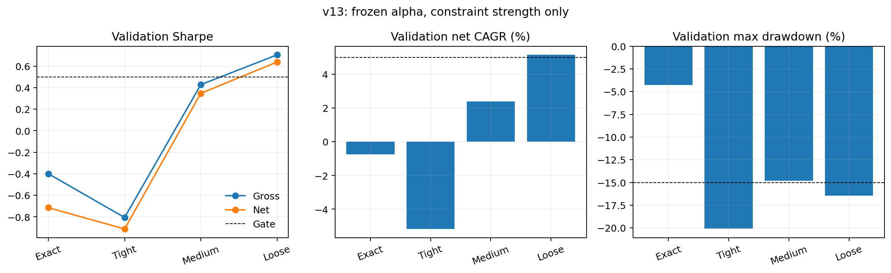

# v13 Cross-Asset Trend Risk-Budget Result

**Decision: REJECTED. Locked test 2021-2024 was not evaluated. Orders remain disabled.**

## Question tested

Does the frozen v12 cross-asset trend alpha survive when exact macro neutrality is replaced by explicit risk budgets? The score, train calibration, data, transaction costs and rebalance frequency were held fixed. B00 is the old exact-neutral reference; B01-B03 change only risk caps.

## Result

| Regime | Train net Sharpe | Development net Sharpe | Development net CAGR | Development max drawdown | Annual turnover |
|---|---:|---:|---:|---:|---:|
| Exact neutral | -0.444 | -0.715 | -0.74% | -4.28% | 2.05x |
| Tight | 0.456 | -0.912 | -5.17% | -20.06% | 6.85x |
| Medium | 0.623 | 0.347 | 2.40% | -14.82% | 7.68x |
| Loose | 0.726 | 0.638 | 5.16% | -16.43% | 7.30x |

B03 is materially better than the exact-neutral reference: train/development Sharpe are 0.726/0.638, and development net CAGR is 5.16%. This supports the construction-mismatch hypothesis: exact neutrality removed the macro trend exposure.

B03 still fails the frozen drawdown gate. Train max drawdown was -15.23% and development max drawdown was -16.43%, versus the -15% limit. The development trough occurred on 2019-04-22 after a -9.41% 2018 calendar return. Because the candidate failed selection, kill tests and the locked test were correctly skipped.

## Constraint and cost audit

B03 stayed within its budgets: maximum factor and sleeve budget ratios were 1.000000 and 1.000000; maximum absolute dollar net was 50.00%. Average gross was 99.98%. Annual transaction and borrow drag were 0.15% and 0.41%.

The next permissible experiment is a pre-specified ex-ante risk overlay on B03, selected only on the training period. The already viewed 2017-2020 interval must be labeled reused development audit rather than clean validation. The 2021-2024 locked test remains untouched.

