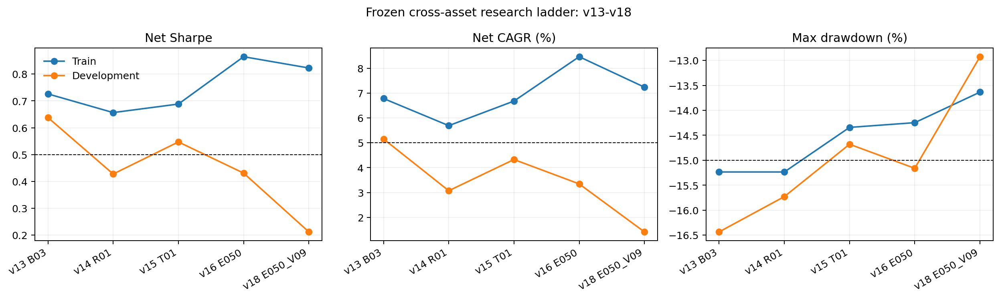
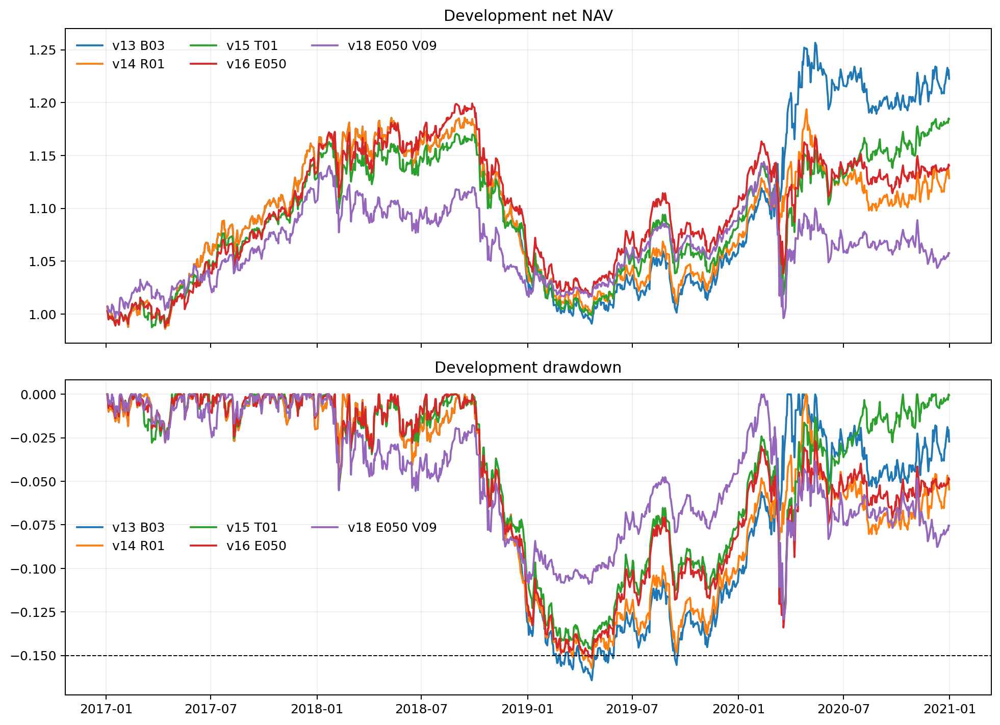

# v13-v18 Cross-Asset Research Report

**Final decision: REJECTED. No strategy may submit orders. The 2021-2024 locked test was never evaluated in v13-v18.**

## What changed and what was learned

1. **v13 isolated portfolio construction.** The frozen v12 cross-sectional trend score was run under exact, tight, medium and loose macro constraints. Loose budgets raised development net Sharpe from -0.715 to 0.638 and net CAGR from -0.74% to 5.16%. This confirms that exact neutrality destroyed intended macro trend exposure. The candidate still failed the -15% drawdown gate at -16.43%.
2. **v14 tested an ex-ante stress scaler.** Prior SPY drawdown and train-frozen realized-volatility thresholds reduced exposure but also reduced development CAGR to 3.07%; drawdown remained -15.73%. It was rejected.
3. **v15 added continuous time-series momentum.** It improved development drawdown to -14.68% but produced only 4.33% CAGR and train Sharpe 0.688. It was rejected.
4. **v16 blended cross-sectional and time-series trend using training only.** The 50/50 winner achieved train Sharpe 0.865, CAGR 8.47%, and drawdown -14.25%, but development Sharpe/CAGR fell to 0.431/3.35%. It was rejected.
5. **v17 expanded the universe from 19 to 45 ETFs.** The best train blend had Sharpe 0.767 and CAGR 6.88% but drawdown -16.69%, so development was never loaded.
6. **v18 selected blend and 8%/9%/10% risk target on training only.** The 50/50, 9% risk-cap winner passed train with Sharpe 0.823, CAGR 7.25%, and drawdown -13.64%. Its first development evaluation fell to Sharpe 0.212 and CAGR 1.41%, so it was rejected.

## Frozen decision table

| Version | Candidate | Train Sharpe | Development Sharpe | Train CAGR | Development CAGR | Train DD | Development DD |
|---|---|---:|---:|---:|---:|---:|---:|
| v13 | B03 | 0.726 | 0.638 | 6.79% | 5.16% | -15.23% | -16.43% |
| v14 | R01 | 0.657 | 0.427 | 5.69% | 3.07% | -15.23% | -15.73% |
| v15 | T01 | 0.688 | 0.547 | 6.68% | 4.33% | -14.34% | -14.68% |
| v16 | E050 | 0.865 | 0.431 | 8.47% | 3.35% | -14.25% | -15.16% |
| v18 | E050_V09 | 0.823 | 0.212 | 7.25% | 1.41% | -13.64% | -12.93% |

## Binding constraint

The implementation now handles risk budgets, temporary ineligibility, transaction costs, borrow, covariance risk, train-only calibration and fail-closed promotion. The repeated failure is information stability: price-only trend looks viable in 2008-2016 but loses most of its edge in 2017-2020. More constraint tuning on the same close-to-close features is no longer justified.

The next research cycle requires a genuinely new information source: point-in-time earnings/analyst revisions, intraday and overnight bars with auction-aware costs, futures curves/carry, or historical borrow/shortability. Alpaca can support intraday bars, but it does not supply the full point-in-time fundamental/revision and borrow history needed for the other sleeves.

## Audit controls

- Every protocol was written before its corresponding run.
- v13-v18 did not load the 2021-2024 locked test because no candidate passed selection and kills.
- All outcomes retained the original cost, turnover, drawdown and return gates.
- Yahoo adjusted data is research-only. Alpaca/SIP replication and prospective paper evidence remain mandatory even if a future candidate passes historical gates.

