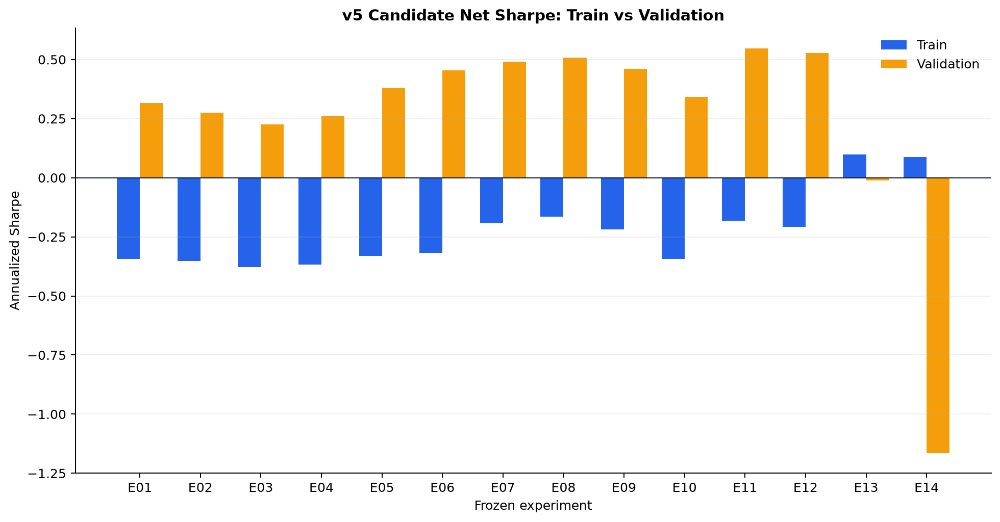
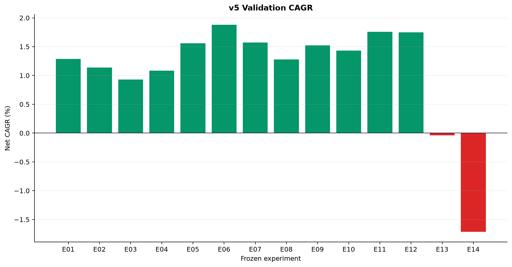
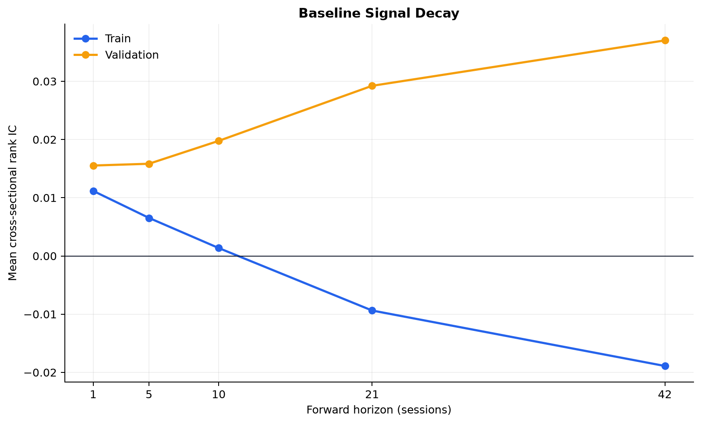
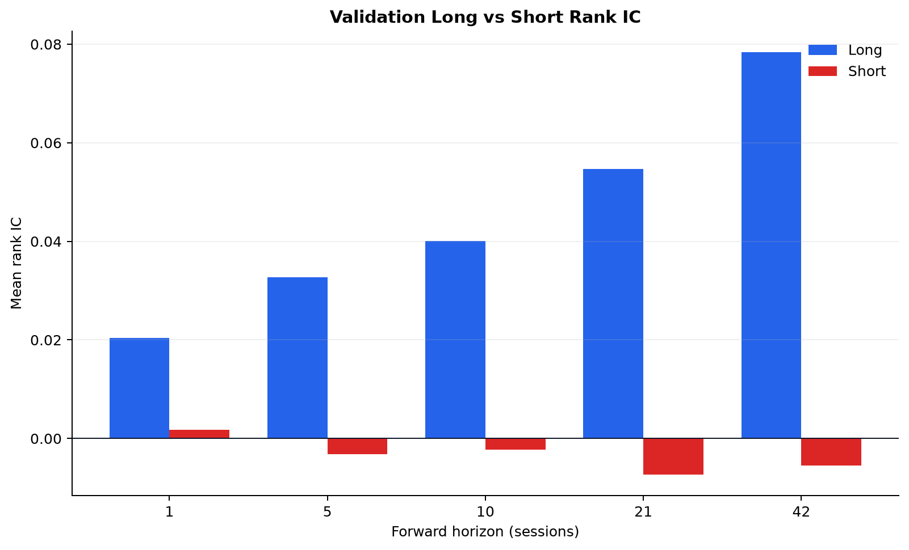

# v5 — Conditional Market-Neutral Stat Arb result

## Decision

**REJECTED.** None of the 14 selectable frozen candidates had positive net Sharpe in both
2018–2022 train and 2023–2024 validation. The selection lock was written without a winner,
kill tests were therefore not run, and 2025–2026 was not evaluated. This preserves the
reused audit from further parameter selection.

## What improved

All E01–E14 targets enforce dollar, rolling-beta and sector neutrality after every trade.
The largest measured rebalance exposure error across completed candidates was below
`6e-15`. The old partial-neutralization behavior is no longer present.

Conditional construction improved the validation segment relative to the unmodified v2
reference, but it did not make performance stable across development periods:

| Experiment | Change | Train net Sharpe | Validation net Sharpe | Validation CAGR |
|---|---|---:|---:|---:|
| E00 | Unmodified v2 reference | -0.30 | 0.11 | 0.37% |
| E01 | Strict-neutral baseline | -0.34 | 0.32 | 1.29% |
| E03 | Strong residual-vol weighting | -0.38 | 0.23 | 0.93% |
| E06 | Strong asymmetric short score | -0.32 | 0.46 | 1.88% |
| E08 | Defensive regime scaler | -0.16 | 0.51 | 1.28% |
| E11 | Mild asymmetry + mild regime | -0.18 | 0.55 | 1.76% |
| E13 | Train-qualified equal-risk ensemble | 0.10 | -0.01 | -0.04% |
| E14 | Train-only ridge ensemble | 0.09 | -1.16 | -1.71% |

E11 had the best validation Sharpe, but its train Sharpe was negative. E13 had the best
worst-segment Sharpe and was closest to stability, but its validation return was slightly
negative. Neither can pass the frozen rule.

## Findings by hypothesis

### A. High residual-volatility conditional weighting

E02–E04 retained the full universe and continuously tilted toward high residual volatility.
All three were worse than strict-neutral E01 in train and validation Sharpe. The earlier Q5
attribution was descriptive; converting it directly into a stronger weight was not a robust
improvement.

### B. Asymmetric long/short construction

E05–E06 improved validation Sharpe from 0.32 to 0.38/0.46, while train remained negative.
The horizon diagnostic supports different long and short behavior: validation long rank IC
was positive at every horizon and reached 0.078 at 42 sessions, while short rank IC was
negative from 5 through 42 sessions. In train, both sides weakened and became negative at
longer horizons. This is a valid prospective hypothesis, not historical proof.

### C. Regime-dependent gross scaling

E07–E08 and combinations E09/E11/E12 produced the strongest validation results and lower
turnover/gross exposure. They still had train Sharpe from -0.16 to -0.22. The observed
regime effect is therefore unstable across development periods and cannot be promoted.

### D. Alpha diversification

Residual reversal and Kalman innovation qualified alongside baseline momentum using only
train five-session rank IC. Volume/volatility dislocation was rejected because its IC
correlation with admitted families was 0.927. Equal-risk E13 was substantially more stable
than the single alpha but missed positive validation. Ridge E14 failed badly out of sample,
showing why added model complexity is not justified here.

### E. Holding horizon

Baseline rank IC was positive at 1 and 5 sessions in both segments. At 21 and 42 sessions,
train rank IC became -0.009/-0.019 while validation rose to 0.029/0.037. The long historical
holding periods are not supported by stable long-horizon decay across train and validation.

### F. Borrow

Uniform 3% annual borrow was charged to every short. Name-level borrow-aware ranking remains
`BLOCKED_MISSING_PIT_BORROW_DATA`; no volatility or liquidity proxy was mislabeled as
historical borrow availability.

## Data erratum

The frozen protocol repeated the old report's “356-name cohort” description. The v2 audit
file actually contains 356 names with continuous adjusted closes, then removes 16 names
with >50% identifier-continuity moves, leaving 344 included names. The frozen train-only
stale-volume rule removes COR, DOW and SNDK, leaving 341 for v5. This is a post-run count
correction; it does not alter the matrix, metrics or selection rule.

## Prospective state

The prospective start is recorded as 2026-09-24, but local data end on 2026-09-18 and no
accepted v5 candidate exists. `orders_allowed=false`; no historical session is counted as
prospective and no paper order was submitted.

Supporting artifacts:

- `candidate_selection.csv`: all candidate metrics and gates.
- `selection_lock.json`: rejection written before any reused-audit evaluation.
- `signal_decay.csv` and `long_short_ic.csv`: horizon diagnostics.
- `alpha_family_qualification.csv` and `ensemble_artifacts.json`: train-only ensemble logic.
- `v5_universe_audit.csv`: train-only stale-volume gate.
- `prospective_shadow_start.json`: prospective boundary and blocked execution state.

## Figures

