# v7 Residual Short-Horizon Alpha Discovery

## Decision

**REJECTED.** None of R01–R08 passed the profitability gates frozen before the run.
The selection lock was written without evaluating 2025–2026, and no paper orders are
allowed. This result does not support rescuing v7 by changing its parameters after seeing
the output.

The central finding is that the residual-reversal forecast has small positive predictive
content, but not enough gross portfolio return to pay the frozen execution and borrow
costs. This is an alpha-strength failure, not a neutrality failure.

## Evidence status

- Protocol freeze: 2026-09-24, before v7 candidate evaluation.
- Train / artifact fit: 2018–2022.
- Development holdout / model selection: 2023–2024.
- Reused audit 2025–2026: **not evaluated**.
- Pristine prospective period: begins 2026-09-24 and has no bars in this dataset.
- Data label: `research_snapshot_only`; the 341-name cohort is not PIT membership data.
- PIT earnings filter: `BLOCKED_MISSING_PIT_EARNINGS_CALENDAR`.
- Name-level borrow ranking: `BLOCKED_MISSING_PIT_BORROW_DATA`.

The development holdout is not described as pristine OOS because earlier research exposed
2018–2026 diagnostics before v7 was designed.

## Candidate results

| ID | Change from core | Train net Sharpe | Development gross Sharpe | Development net Sharpe | Development net CAGR | Decision |
|---|---|---:|---:|---:|---:|---|
| R01 | Frozen 1/3/5 residual blend, rebalance 3 | -0.403 | 0.187 | -0.824 | -1.07% | fail |
| R02 | Rebalance 2 | -0.410 | 0.321 | -0.795 | -1.28% | fail; turnover 31.5x |
| R03 | Rebalance 5 | 0.246 | -0.462 | -1.280 | -1.52% | fail |
| R04 | Mild residual-volatility tilt | -0.438 | 0.118 | -0.869 | -1.14% | fail |
| R05 | Strong residual-volatility tilt | — | — | — | — | invalid target transition |
| R06 | Market-volatility stress scaler | -0.567 | 0.188 | -0.823 | -1.07% | fail |
| R07 | Separate long/short magnitude ranks | -0.509 | 0.176 | -0.937 | -1.08% | fail |
| R08 | Mild residual-volatility tilt + stress scaler | -0.595 | 0.119 | -0.868 | -1.14% | fail |

Frozen gates were train Sharpe above 0.70, development Sharpe above 0.50,
development net CAGR above 5%, drawdown no worse than -15%, annual turnover no greater
than 25x, and zero neutrality failures. Every completed candidate missed the profitability
gates. R05 was invalid because the stronger weighting made a required eligibility or
neutrality correction infeasible under the frozen turnover constraints; the engine did
not accept a partial target.

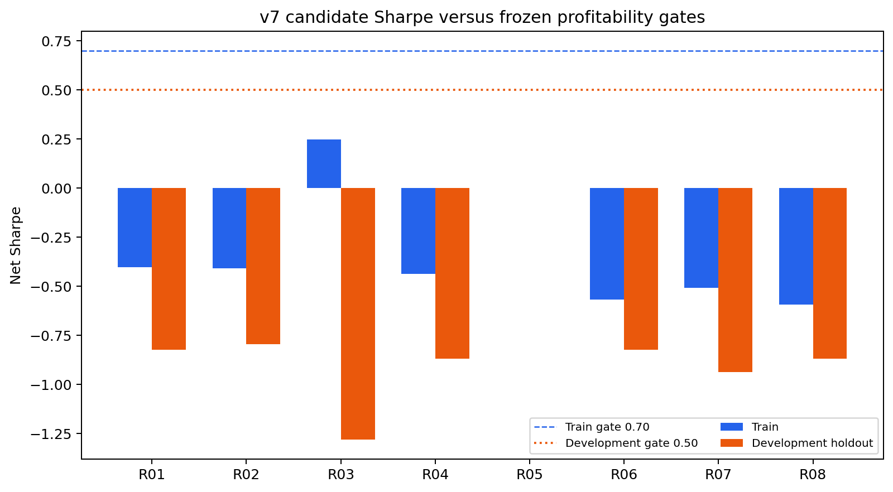

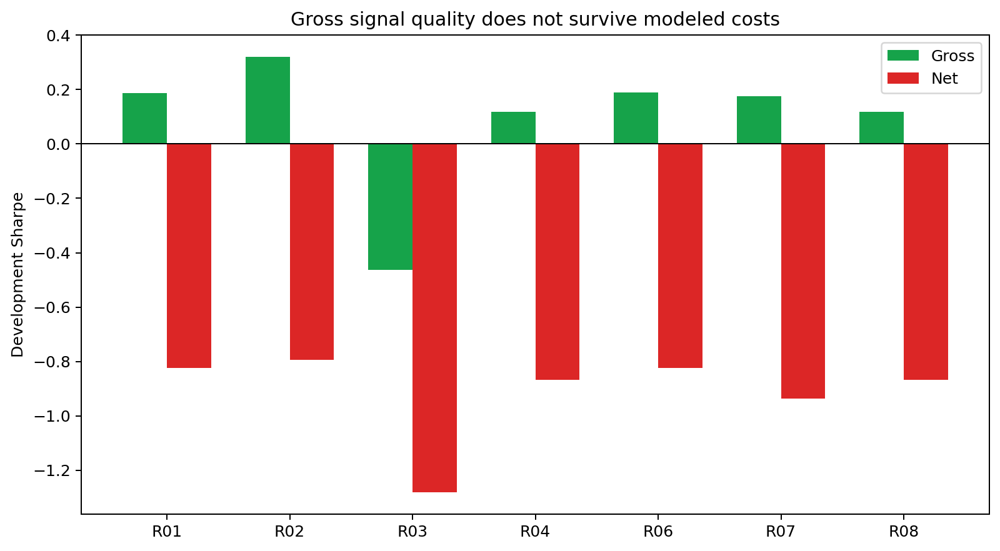

## Why the strategy failed

R01 development gross CAGR was only **0.23%** and gross Sharpe was **0.187**. Over the two
development years, modeled transaction costs consumed 1.47% of NAV and common borrow
consumed another 1.14%. That changed a weakly positive gross result into **-1.07% net
CAGR** and **-0.824 net Sharpe**. Typical full-year cost drag was about **1.30% of NAV**.

R02 increased gross Sharpe to 0.321, but its 31.5x annual turnover breached the 25x gate
and higher costs still produced negative net performance. R03 cut turnover to 12.55x, but
its development gross Sharpe turned negative. The frozen holding/rebalance alternatives
therefore did not reveal a tradable horizon.

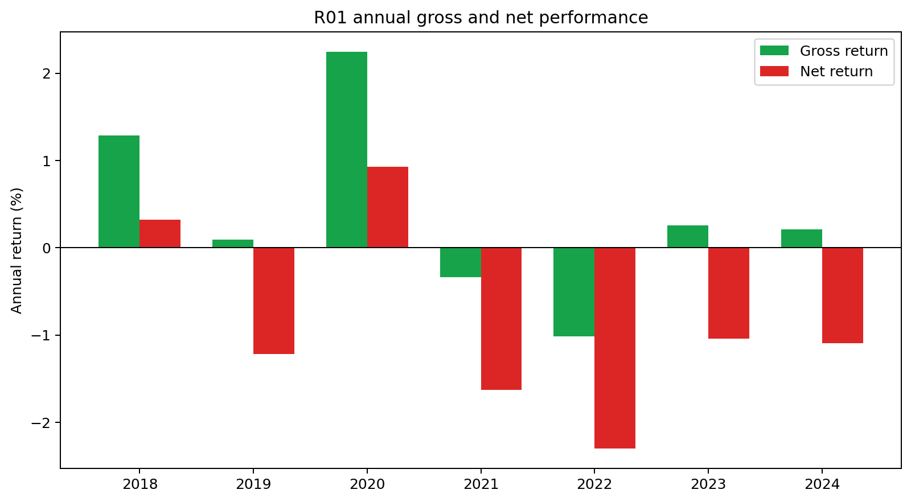

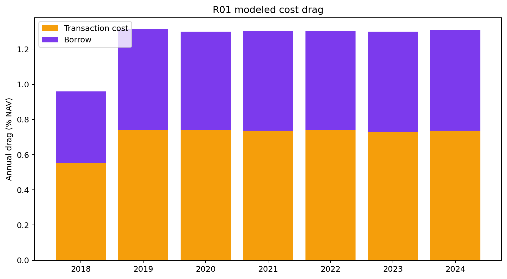

## Predictive content and side asymmetry

The core signal's one-session rank IC was **0.0116** in train and **0.0189** in development.
Development rank IC declined to 0.0086 by five sessions and was approximately zero by ten
sessions. This is statistically interesting but economically too small for the modeled
turnover and borrow burden.

The development long side retained positive rank IC across all reported horizons. The
short side was positive only at one session, approximately zero at two sessions, and
negative from three sessions onward. Annual attribution matches this instability: long
PnL was positive in 2019–2021 and 2023–2024, while the short book offset much of it. In
2022 the sign pattern reversed. A stable symmetric long-short forecasting relationship
was not present.

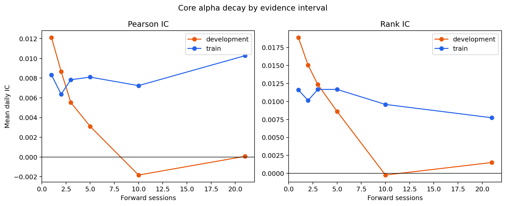

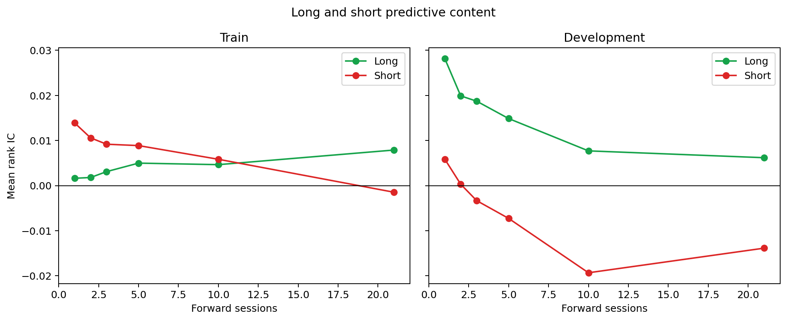

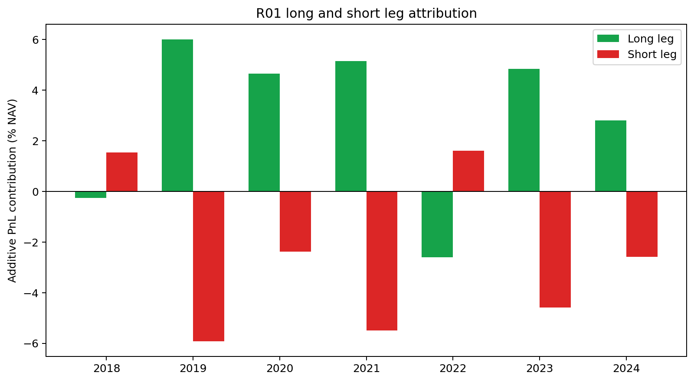

## Conditional diagnostics

The hypothesized high-residual-volatility advantage did not survive this new alpha family.
Q5 contributed -0.27% annualized gross PnL in train and -0.79% in development. Q2 was the
strongest development bucket. Because these are post-run diagnostics, they cannot justify
changing v7 to overweight Q2 or exclude Q5.

Regime relationships were also unstable. High dispersion produced +0.89 bps mean daily
net return in train and approximately -0.03 bps in development. Market stress below a
15% drawdown produced +1.62 bps in train but -3.43 bps in development. This sign reversal
explains why a fixed stress scaler did not improve the candidate.

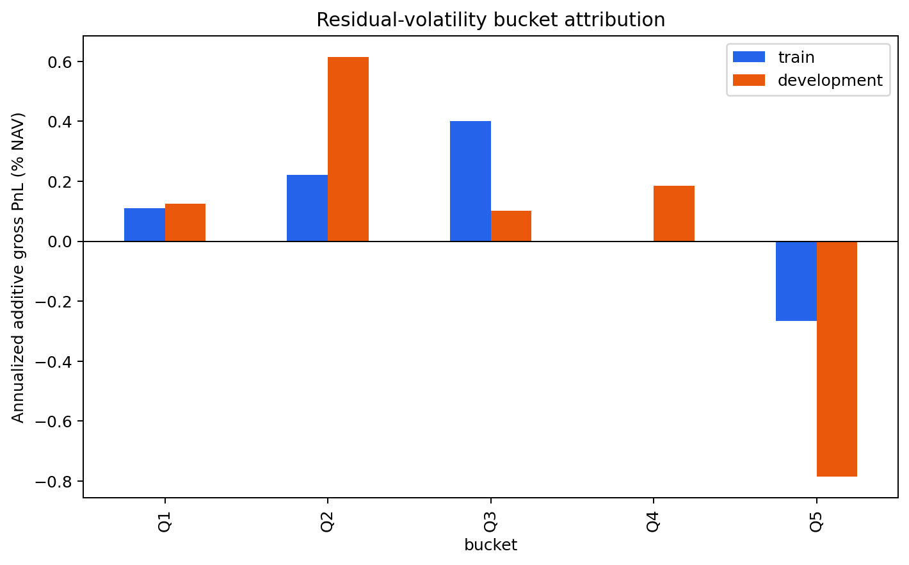

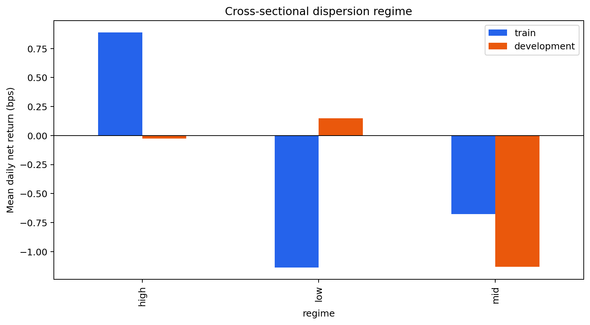

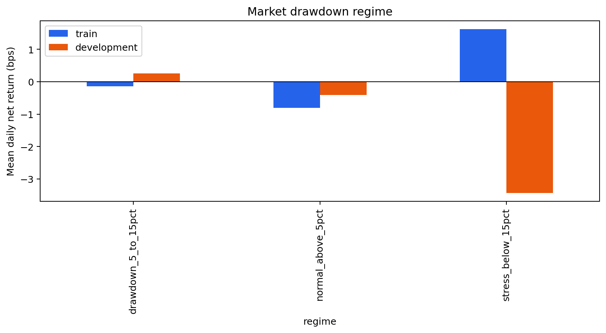

## Construction integrity and holding duration

All completed candidates satisfied dollar, beta, and sector neutrality at actual rebalance
targets. R01's largest annual target exposure was around 3e-15, far below the 1e-8 hard
tolerance. The dynamic liquidity universe averaged 250 eligible names after the warm-up,
and names leaving it were explicitly liquidated and charged turnover and cost.

The 3-session rebalance interval did **not** create a literal 2–5 session maximum holding
period. Completed R01 episodes averaged roughly 12–14 sessions because persistent ranks
kept positions on consecutive rebalances. Any later strategy requiring a hard 2–5 day
economic horizon must use expiring tranches or a mandatory age exit; it cannot infer that
behavior from rebalance frequency alone.

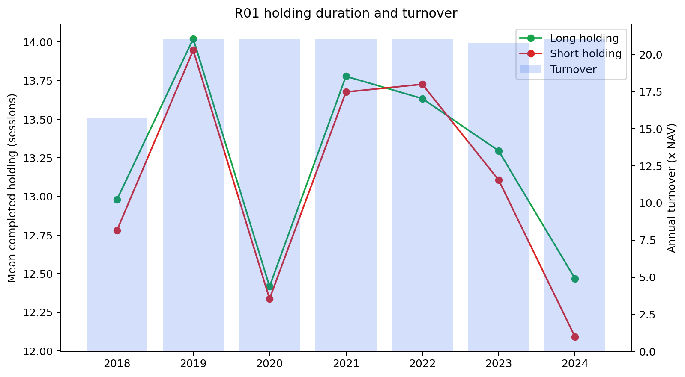

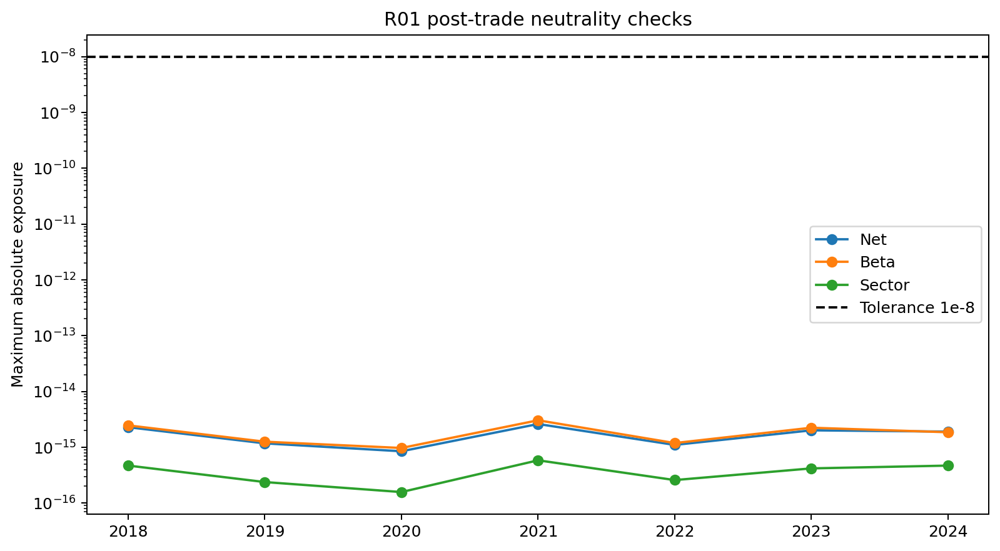

## Research conclusion

v7 answered the intended question without using the reused audit: short-horizon
market/sector residual reversal in this daily Alpaca research cohort is not a sufficiently
strong standalone alpha after realistic costs. Residual-volatility tilts, a continuous
stress scaler, side-specific ranking, and 2/3/5-session rebalance choices did not change
that conclusion.

The next experiment should switch alpha family. With the current data, the available
independent direction is a separately frozen overnight/intraday decomposition. A
post-earnings or fundamentals-drift family remains blocked until PIT event and fundamental
data are acquired. Any next version should also use explicit expiring position tranches if
its hypothesis requires a hard holding horizon.

## Reproduction

```bash
PYTHONPATH=. python scripts/evaluate_equity_v7.py
PYTHONPATH=. python scripts/diagnose_equity_v7.py
PYTHONPATH=. python scripts/plot_v7_results.py
```

Machine-readable decisions are in `selection_lock.json`, `kill_test_lock.json` and
`SUMMARY.json`. Candidate metrics are in `candidate_selection.csv`; all diagnostic source
tables are stored beside this report.
