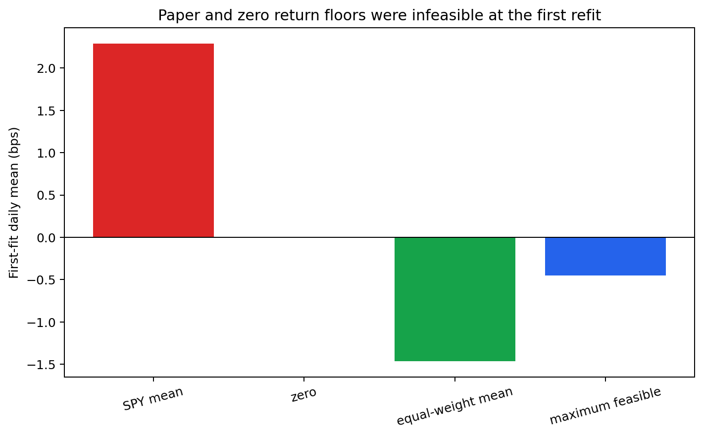
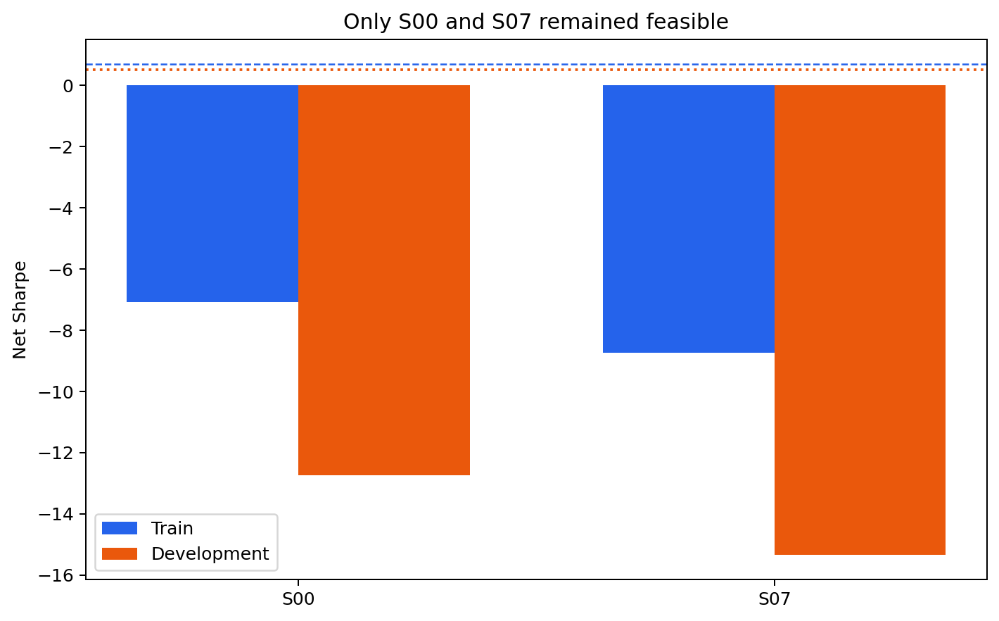
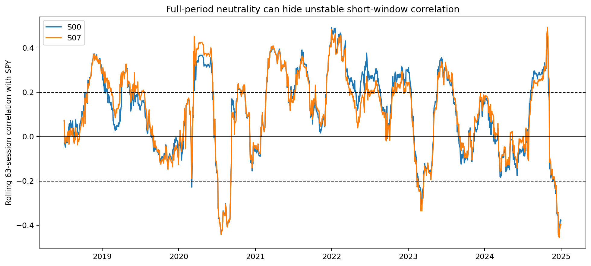
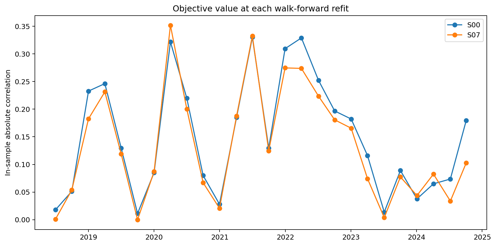
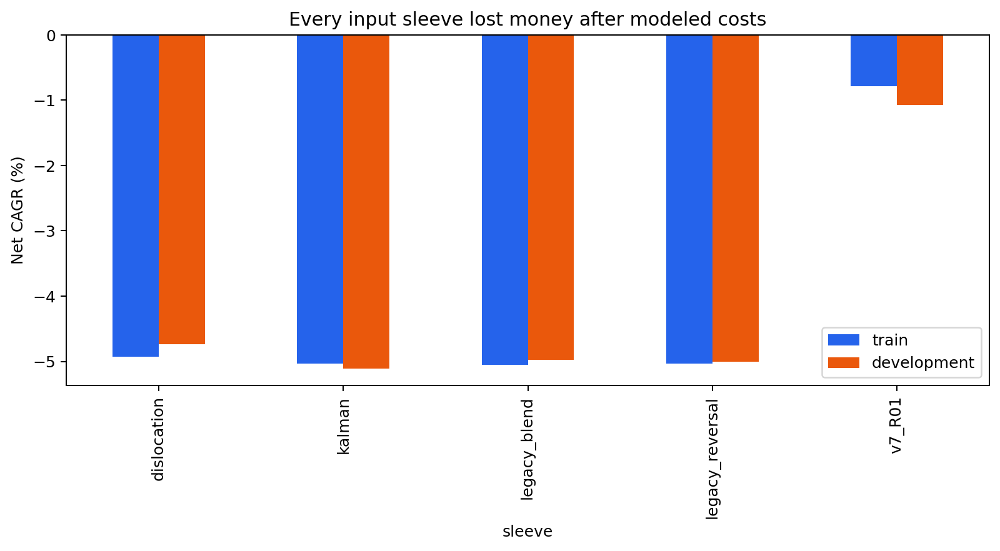
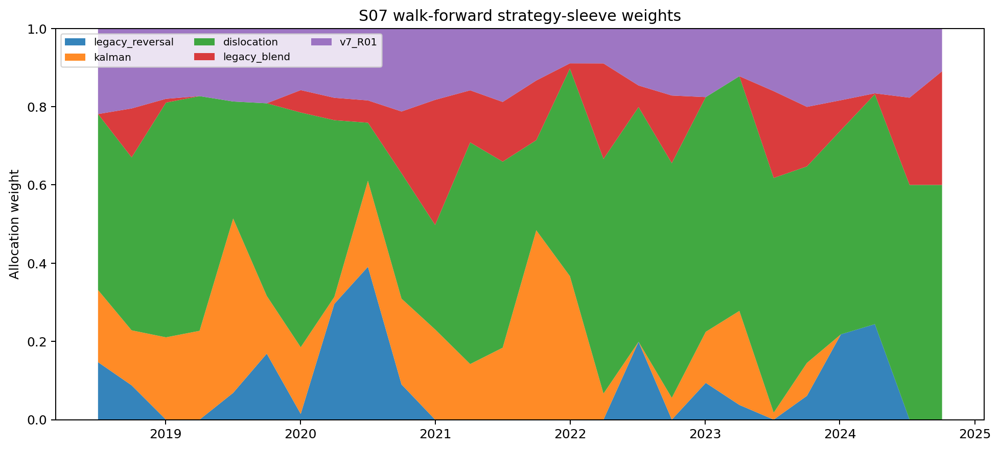
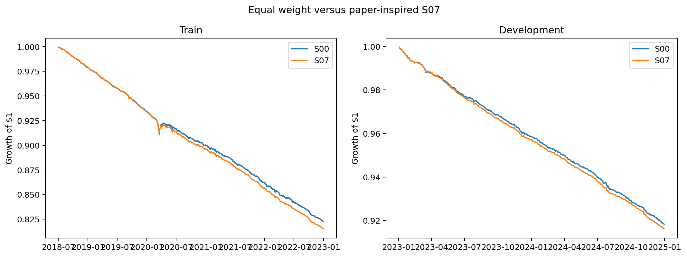
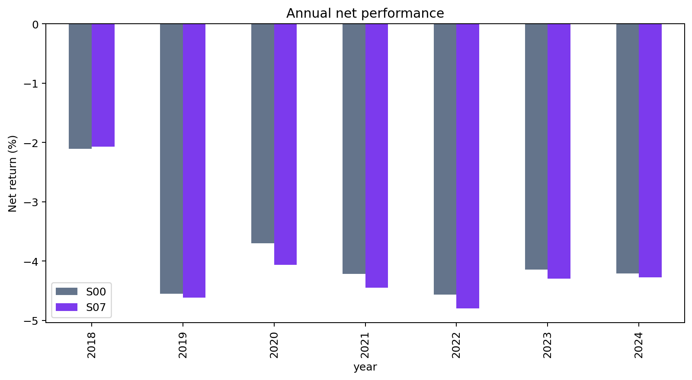

# v8 Correlation-Neutral Strategy-Sleeve Allocation

## Decision

**REJECTED.** The paper-inspired objective reduced in-sample correlation at some refits, but
it did not improve out-of-sample profitability. No candidate passed the frozen profitability
gates, 2025–2026 was not evaluated, and no paper orders are allowed.

This is a useful negative result: correlation minimization can make a portfolio more neutral,
but it cannot create positive alpha when every input strategy loses money after costs.

## What the paper actually optimizes

Rodrigues and Carrano (2023), *Market-Neutral Portfolios: A Solution based on Automated
Strategies*, combine returns from multiple automated trading systems. Their objective is the
absolute Pearson correlation between portfolio return and a market index:

```text
minimize |Corr(portfolio return, index return)|
```

Their decision variables are nonnegative units assigned to long or long/short ATS streams.
An optional in-sample constraint requires average portfolio return to be at least average
index return. Weights are fitted on three- or six-month in-sample windows and applied to the
next walk-forward interval.

The paper does not provide a new stock-level alpha and its objective is not equivalent to
this repo's beta constraint. It studied 30 proprietary Brazilian futures ATS streams, mostly
intraday, without this repo's US-equity borrow, liquidity, sector and transaction-cost model.
Its reported Sharpe ratios should not be transferred to this dataset.

## v8 adaptation

The ATS analogues were five existing net-return sleeves: legacy residual reversal, Kalman
innovation, volume/volatility dislocation, the legacy blend, and v7 R01. v8 used nonnegative
weights summing to one, a 60% sleeve cap, a 60% reallocation-turnover cap, and an additional
5 bps allocation cost. Sleeve notionals drifted between refits; there was no uncharged daily
reset.

S01–S03 reproduced the paper's return floor against SPY with 3/6-month windows. S04–S06
used a zero return floor, with optional variance/downside and shrinkage terms. S07 required
only that fitted return be no worse than the contemporaneous equal-weight sleeve return.

## Return-floor feasibility

The first frozen fit window explains most of the result:

| Quantity | Daily mean |
|---|---:|
| SPY floor | +2.291 bps |
| Zero floor | 0.000 bps |
| Equal-weight sleeve portfolio | -1.461 bps |
| Maximum feasible under 60% sleeve cap | -0.451 bps |

v7 R01 earned +0.504 bps per day in that first fit window, but the 60% concentration cap
required at least 40% in another sleeve. The best remaining sleeve lost 1.884 bps per day,
so even the maximum feasible combination was negative. Consequently S01–S06 were infeasible
at the first scheduled refit on 2018-07-02. The engine rejected them rather than relaxing the
return floor.



## Completed candidates

Only the equal-weight reference S00 and equal-weight-return-floor candidate S07 completed.

| Metric | S00 equal weight | S07 paper-inspired |
|---|---:|---:|
| Train Sharpe | -7.089 | -8.732 |
| Development Sharpe | -12.737 | -15.333 |
| Development CAGR | -4.19% | -4.30% |
| Train correlation with SPY | 0.198 | 0.197 |
| Development correlation with SPY | 0.011 | 0.013 |
| Max development rolling 63d correlation | 0.450 | 0.493 |
| Development allocation turnover | 0.012x/year | 1.295x/year |
| Development allocation cost | 0.001% NAV | 0.129% NAV |

S07 reduced the mean in-sample absolute correlation at refits from 0.150 to 0.134. That
improvement did not persist in development: full-period correlation was slightly worse and
the maximum rolling correlation increased. Performance also deteriorated after the added
turnover and concentration in the wrong low-volatility sleeve.







## Why optimization selected a losing sleeve

All five input strategies had negative net CAGR in both development intervals. During
2023–2024 the four legacy sleeves lost roughly 4.7–5.1% per year; v7 R01 lost 1.07% per year.
The correlation-plus-variance objective did not maximize return. It preferred the smooth,
low-variance dislocation stream even though that stream had the most negative development
Sharpe.

S07's average fitted weights were approximately:

| Sleeve | Average weight |
|---|---:|
| Dislocation | 49.6% |
| v7 R01 | 16.7% |
| Kalman | 15.3% |
| Legacy blend | 10.3% |
| Legacy reversal | 8.1% |

This illustrates the central weakness of correlation-only allocation: a stable loss stream
can look attractive because it is low variance and weakly correlated with the benchmark.
The paper's return constraint is intended to prevent that outcome, but here the constraint
was infeasible because the available sleeves did not contain enough positive return.









## Implication for the existing portfolio optimizer

The stock-level optimizer already enforces exact rolling beta, sector and dollar neutrality.
Adding a historical-correlation objective is therefore mostly redundant for exposure control.
At the strategy-sleeve level it can diversify realized residual regimes, but only after the
system contains at least two independently profitable net alpha streams.

The paper's objective should remain available as a diagnostic or secondary penalty. It should
not replace expected return, risk and transaction cost in the primary objective. A suitable
future form is:

```text
maximize expected_alpha - risk - trading_cost - borrow_cost
subject to dollar/beta/sector neutrality
and a bounded realized-correlation penalty or constraint
```

The immediate bottleneck remains alpha discovery. Reweighting the current sleeves cannot
meet the requested performance gate because their net opportunity set lies below zero.

## Integrity and reproduction

- Protocol and implementation were committed before v8 results were run.
- Selection used data only through 2024-12-31.
- Selection status: `REJECTED`.
- Kill tests: not run because no candidate was selected.
- Reused audit: not evaluated.
- Data label: `research_snapshot_only`.

```bash
PYTHONPATH=. python scripts/evaluate_equity_v8.py
PYTHONPATH=. python scripts/diagnose_equity_v8.py
PYTHONPATH=. python scripts/plot_v8_results.py
```

Machine-readable locks and inputs are stored beside this report.
